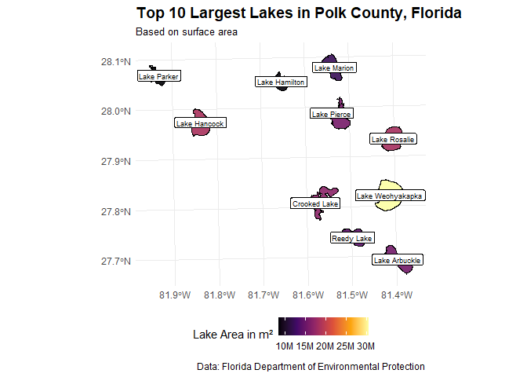
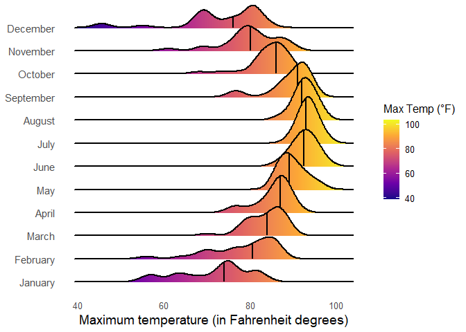

# Data Visualization and Reproducible Research

> Tobias Syring - tsyring0082@floridapoly.edu 

The following is a sample of products created during the _"Data Visualization and Reproducible Research"_ course.

## Project 01

In this project, I explored the temporal and spatial distribution of rat sightings in New York City from 2015 to 2017.  
The visualizations highlight patterns across weekdays, boroughs, and months to uncover trends in reporting behavior and rodent activity.

**Project 01 contains three visualizations:**

- **Visualization 1** – Sightings by Weekday  
- **Visualization 2** – Sightings by Borough and Weekday  
- **Visualization 3** – Sightings by Month

As an example, see below:
**Sample Data Visualization: Visual 3 – Sightings by Month**  

You can find the all visualizations, the full code and report in the `project_01/` folder.

### Revisions
Revisions made for project 1 after gaining additional experience and knowledge for the final submission:

- Improved plot clarity by adjusting the orientation (removed `coord_flip()`), resulting in better readability with vertical bars for Visualization 1  
- Enhanced aesthetics by adding black outlines and using more appealing colors  
- Ensured reproducibility through use of the `here` library for consistent file paths  
- Refined labels and layout for clarity and accessibility, improving overall interpretation
- Further Description to give easier insights for the approach
- Enabled Markdown output rendering for GitHub by specifying the correct YAML header in the `.Rmd` file to automatically generate a `.md` version upon knitting

## Project 02

In this project, I explored three different datasets across domains I find personally engaging: sports, geography, and real estate. Each visualization showcases a distinct type: **interactive**, **spatial**, and **model-based**.

**Project 2 contains 3 Visualizations**

- **Visual 1, interactive** – FIFA 18 Ratings: Interactive Scatter Plot  
- **Visual 2, spatial** – Florida Lakes: Top 10 in Polk County  
- **Visual 3, model based** – West Roxbury Housing Prices: Model-Based Scatter plot with Regression

As an example:  
**Sample Data Visualization: Visual 2 – Florida Lakes in Polk County**  

You can find all visualizations, full code, and the final report in the `project_02/` folder.

### Revisions
Revisions made for Project 2 after gaining additional experience and feedback:
- Minor improvements to plot layout and formatting to enhance readability
- Enabled Markdown output rendering for GitHub by specifying the correct YAML header in the `.Rmd` file to automatically generate a `.md` version upon knitting

## Project 03

In this project, I explored multiple data visualization techniques on both **weather data** and **material science data**. The work is divided into two parts:
**Part 1:** Visualizes the distribution of **maximum temperatures and precipitation** in Tampa, FL during 2022, using histograms, density plots, and ridgeline plots.
**Part 2:** Uses a dataset on **concrete compressive strength** to explore relationships between concrete ingredients, age, and resulting strength using histograms, boxplots, and scatterplots.

Project 3 contains a total of **8 visualizations**:

- **Part 1: Tampa Weather (2022)**
  - **1a** Histogram of max temperatures by month
  - **1b** Overall density plot of max temperature
  - **1c** Faceted density plots for each month
  - **1d** Ridgeline plot of max temperatures by month
  - **1e** Ridgeline plot of precipitation by month

- **Part 2: Concrete Data**
  - **2.1** Histograms of each cement and water content in concrete samples
  - **2.2** Boxplot of strength across concrete age
  - **2.3** Scatterplot of cement conetn vs strength, with water content representing color and age representing point size

**Sample Data Visualization: Visual 1d – Max Temperature by Month – Ridgeline Plot**

### Moving Forward

Throughout this course, I’ve gained a deeper understanding for the role of data visualization in uncovering insights and communicating them effectively. I learned how thoughtful design decisions, such as color, layout, and annotations, can significantly enhance the clarity and impact of a visualization. Working with real-world datasets helped me understand the importance of preprocessing, simplifying complex data, and tailoring visualizations to the intended use case and audience.

I also became more comfortable with principles of reproducible research, especially using R projects, relative file paths with the `here` package, and Markdown-based documentation. These practices not only improved the structure and transparency of my work but also prepared me for collaboration and sharing my work with peers.

Going forward, I plan to deepen my understanding of effective data storytelling techniques. I’m particularly interested in combining visual analysis with predictive modeling and continuing to improve how I present data in a clear, and engaging way.
Additionally, I would like to learn more about Tableau. Its intuitive drag-and-drop interface and dashboarding capabilities offer a different, often faster and easier way to build powerful visuals, especially in business contexts. Gaining further experience in Tableau would expand my toolbox and help me better communicate insights to a broader audience, including those unfamiliar with code-based environments.
At the same time, I see the value of using R for data visualizations. It offers a high level of customization and precise control over every element of a plot, thanks to the layered approach of `ggplot2`. This flexibility is especially useful when designing detailed visualizations or making specific adjustments that tools like Tableau may not support as easily. While Tableau excels at producing fast and user-friendly visuals, R allows for deep data manipulation and fine-tuned visual design, making it ideal for more technical or tailored data storytelling.

