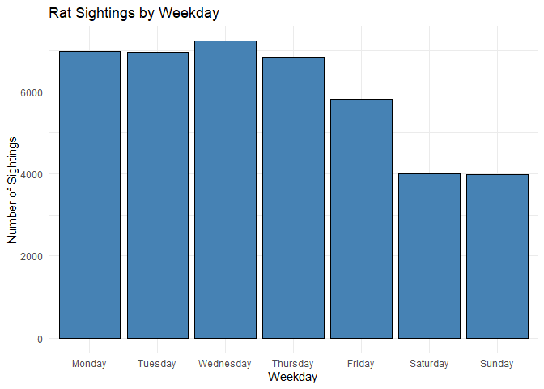
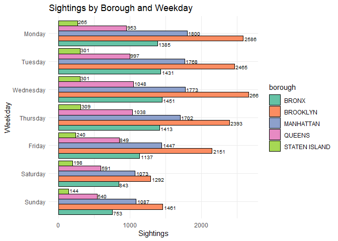
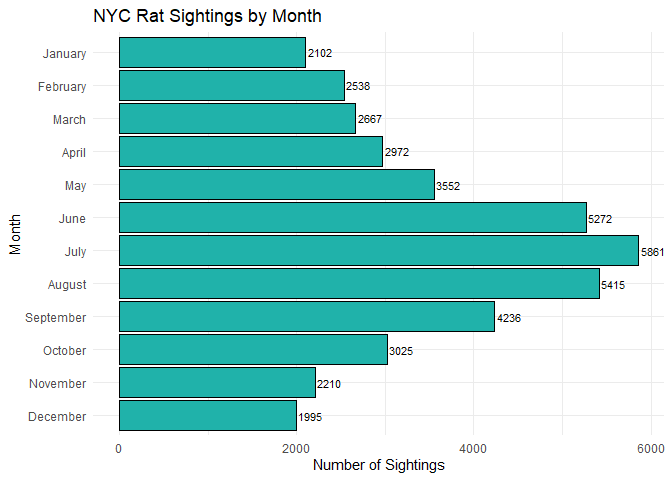

# Data Visualization Project 01

_revised version of mini-project 01 goes here_


``` r
library(tidyverse)
library(dplyr)
library(lubridate)
library(readr)
library(forcats)
library(here)
```


``` r
getwd()
```

```
## [1] "C:/Users/Tobias/Documents/Courses FloridaPoly/Semester 3/Data Visualisation and Reproducible Research/Projects/dataviz_final_project(1)/dataviz_final_project-main/project-01"
```


``` r
rats <- read_csv(here("data", "rats_nyc.csv"), col_types = cols(landmark = col_character())) #there were parsing issues, col_types was specified to avoid those, after using problems(rats) it showed that logical TRUE/FALSE was expected in column 18, but names where in that column
head(rats)
```

```
## # A tibble: 6 × 56
##   unique_key created_date        closed_date   agency agency_name complaint_type
##        <dbl> <dttm>              <chr>         <chr>  <chr>       <chr>         
## 1   31464015 2015-09-04 00:00:00 09/18/2015 1… DOHMH  Department… Rodent        
## 2   31464024 2015-09-04 00:00:00 10/28/2015 1… DOHMH  Department… Rodent        
## 3   31464025 2015-09-04 00:00:00 <NA>          DOHMH  Department… Rodent        
## 4   31464026 2015-09-04 00:00:00 09/14/2015 1… DOHMH  Department… Rodent        
## 5   31464027 2015-09-04 00:00:00 09/22/2015 1… DOHMH  Department… Rodent        
## 6   31464188 2015-09-04 00:00:00 09/22/2015 1… DOHMH  Department… Rodent        
## # ℹ 50 more variables: descriptor <chr>, location_type <chr>,
## #   incident_zip <dbl>, incident_address <chr>, street_name <chr>,
## #   cross_street_1 <chr>, cross_street_2 <chr>, intersection_street_1 <chr>,
## #   intersection_street_2 <chr>, address_type <chr>, city <chr>,
## #   landmark <chr>, facility_type <lgl>, status <chr>, due_date <chr>,
## #   resolution_action_updated_date <chr>, community_board <chr>, borough <chr>,
## #   x_coordinate_state_plane <dbl>, y_coordinate_state_plane <dbl>, …
```

``` r
problems(rats)
```

```
## # A tibble: 0 × 5
## # ℹ 5 variables: row <int>, col <int>, expected <chr>, actual <chr>, file <chr>
```

``` r
colnames(rats)
```

```
##  [1] "unique_key"                     "created_date"                  
##  [3] "closed_date"                    "agency"                        
##  [5] "agency_name"                    "complaint_type"                
##  [7] "descriptor"                     "location_type"                 
##  [9] "incident_zip"                   "incident_address"              
## [11] "street_name"                    "cross_street_1"                
## [13] "cross_street_2"                 "intersection_street_1"         
## [15] "intersection_street_2"          "address_type"                  
## [17] "city"                           "landmark"                      
## [19] "facility_type"                  "status"                        
## [21] "due_date"                       "resolution_action_updated_date"
## [23] "community_board"                "borough"                       
## [25] "x_coordinate_state_plane"       "y_coordinate_state_plane"      
## [27] "park_facility_name"             "park_borough"                  
## [29] "school_name"                    "school_number"                 
## [31] "school_region"                  "school_code"                   
## [33] "school_phone_number"            "school_address"                
## [35] "school_city"                    "school_state"                  
## [37] "school_zip"                     "school_not_found"              
## [39] "school_or_citywide_complaint"   "vehicle_type"                  
## [41] "taxi_company_borough"           "taxi_pick_up_location"         
## [43] "bridge_highway_name"            "bridge_highway_direction"      
## [45] "road_ramp"                      "bridge_highway_segment"        
## [47] "garage_lot_name"                "ferry_direction"               
## [49] "ferry_terminal_name"            "latitude"                      
## [51] "longitude"                      "location"                      
## [53] "sighting_year"                  "sighting_month"                
## [55] "sighting_day"                   "sighting_weekday"
```

For my Data Visualisations, I am primarily interested in exploring the temporal and local distribution of rat sightings in New York City.

# Data Visualizations

## Visualization 1: Rat Sightings by Month
For my visualization I would like to see  how rat sightings in New York City are distributed across the days of the week.
I want to identify possible patterns in the daily activities.


### Data Preparation Visualisation 1

``` r
weekday_levels <- c("Monday", "Tuesday", "Wednesday", "Thursday", "Friday", "Saturday", "Sunday")

rats_by_weekday <- rats %>%
  count(sighting_weekday) %>%
  mutate(sighting_weekday = factor(sighting_weekday, levels = weekday_levels))
```

### Visualization 1: Rat Sightings by weekday
By analyzing the weekday distribution, can help to identify temporal patterns in rat activity or reporting behavior, such as whether certain days see more sightings due to increased human presence, waste generation, or reporting frequency.


``` r
ggplot(rats_by_weekday, aes(x = sighting_weekday, y = n)) +
  geom_col(fill = "steel blue", colour="black") +
  labs(title = "Rat Sightings by Weekday", x = "Weekday", y = "Number of Sightings")+
  theme_minimal()
```

<!-- -->

## Visualization 2: Rat Sightings by borough
After exploring the overall weekday distribution, I now want to examine how rat sightings vary across the five boroughs throughout the week. 
This helps identify location-specific patterns and whether certain days are more active in specific areas.


### Data Preparation Visualisation 2


``` r
rats_by_borough <- rats %>%
  mutate(sighting_weekday = factor(sighting_weekday, levels = weekday_levels)) %>%
  group_by(borough, sighting_weekday) %>%
  summarize(n = n(), .groups = "drop")
```

### Visualization 2


``` r
ggplot(rats_by_borough, aes(x = fct_rev(sighting_weekday), y = n, fill = borough)) +
  geom_col(position = "dodge", color="black") +
  coord_flip()+
  labs(title = "Sightings by Borough and Weekday", x = "Weekday", y = "Sightings")+
  geom_text(aes(label = n),position = position_dodge(width = 1), hjust = -0.1, size = 2.7)+
  scale_fill_brewer(palette = "Set2") + 
  theme_minimal()
```

<!-- -->

## Visualization 3: Rat Sightings by Month
After exploring the daily distribution, I now want to examine how rat sightings vary across the months of the year.  
This helps identify seasonal patterns and understand when sightings tend to peak.


### Data Preparation Visualisation 3


``` r
rats_by_month <- rats %>%
  count(sighting_month) %>%
  mutate(sighting_month = factor(month.name[sighting_month], levels = rev(month.name)  ))
```

### Visualization 3

``` r
ggplot(rats_by_month, aes(x = sighting_month, y = n)) +
  geom_col(fill = "lightseagreen", color="black") +
  coord_flip() +
  geom_text(aes(label = n), hjust = -0.1, size = 3)+
  labs(title = "NYC Rat Sightings by Month", x = "Month", y = "Number of Sightings")+
  theme_minimal()
```

<!-- -->

# Discussion Report
The following section addresses the questions for the report.

## Introduction

This mini-project explores a real-world data set of rat sightings in New York City. The analysis focuses on uncovering time and space related patterns. I would like to investigate how rat sightings vary across weekdays, boroughs, and months of the year. 

## What were the original charts you planned to create?

The original plan was to explore how rat sightings in New York City varied over time and location. I intended to visualize counts by weekday to detect temporal patterns throughout the week, then map those findings across boroughs to compare geographic variation. A third idea was to analyze trends over multiple years, but this was later replaced by a monthly distribution to capture seasonal effects more clearly. The idea with trends over the years was not further explored, because this data set captures only the period 2015 till 2017.

## What story could you tell with your plots?

The weekday plot demonstrates that sightings are most frequent on weekdays, particularly between Tuesday and Thursday. This may indicate higher rodent activity during business days when human foot traffic and garbage waste on the street are at their peak, people go to the office, have lunch break somewhere and everything is active during weekdays. Moreover, garbage is often stored outside on the street and garbage collection happens during the week, which means there is more trash exposed and moved. Alternatively, it could reflect increased likelihood of sightings and reports due to more people being out and in offices, schools, and public spaces. In contrast, the dip on weekends, especially Sunday, may be due to decreased public presence and lower attention from sanitation or city workers, leading to fewer reported incidents rather than an actual drop in rat activity.

The borough-wise chart, broken down by weekday, reveals that Brooklyn consistently has the highest number of sightings. Manhattan and the Bronx follow, while Queens and Staten Island report fewer sightings. These patterns could result from differences in population density,  infrastructure, cleaning practices, and public awareness. For example, dense urban areas with older infrastructure may provide better conditions for rats, like given in Brooklyn. Higher reporting rates could also come form community responsiveness and awareness in those areas.

The third plot shows a distinct seasonal trend when rat sightings are aggregated by month. Sightings increase notably during the summer months, with its peak in July, and drop during colder months such as December and January. This seasonal pattern aligns with typical rodent behavior, as rats are more active and visible in warm weather. Additionally, the warmer months see more outdoor human activity resulting in more trash and food waste due to events and people being outside, increasing both rat movement and the chance of them being seen and reported. During colder months, rats may stay underground or indoors, resulting in fewer public sightings. In addition, the amount of tourists visiting New York might be an influence as well, especially during the summer, as higher foot traffic may lead to more frequent sightings and reports. 

Together, these plots tell a cohesive story about when and where rat sightings are most occurring in NYC, and they reflect the combined influence of rodent activity, human behavior, urban structure, and reporting habits.


## How did you apply the principles of data visualizations and design for this assignment?

To prepare my data key R Functions were applied throughout the assignment. First, I used the factors to manually define the order of categorical variables such as weekdays and months. This ensured that the plots followed a logical sequence, rather than an unfamiliar sorting. Data was aggregated using group_by() and summarize() to calculate counts per time period or borough, enabling focused and clean comparisons.

For the visual design, I applied the theme_minimal() across all plots to reduce unnecessary distractions and ensure a consistent aesthetic. This clean layout helps the viewer focus on the data itself. In horizontal bar plots, coord_flip() was used to improve label readability and avoid overlapping text on the axis. I also used position = "dodge in grouped bar plots, rather than letting them stack, to make comparisons between boroughs across weekdays more intuitive.

Color played a critical role in distinguishing categories. I applied a customized fill and used the palette = "Set2" to create a more visually appealing color pattern. This replaced the default black bars with colorful, outlined bars that enhance both contrast and readability. To get a clear separation between the neighbouring bars an outline was used. The outline was achieved by specifying color = "black" inside geom_col(), which added a clean black border around each bar for visual separation, making the grouped data easier to interpret. Similar attention was given to the other charts, where distinct but appealing colors were chosen to improve overall presentation.

These combined design decisions aimed to make the visuals accessible, informative, and stylistically consistent, aligning with the principles covered in the course materials.


## Conclusion

These visualizations show how rat sightings vary by weekday, month, and borough in NYC. Patterns suggest a potential link between human activity and reporting frequency, with notable borough-specific trends.
