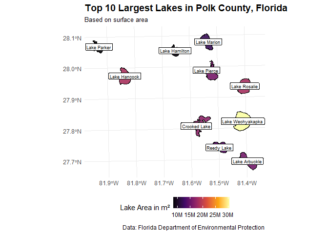
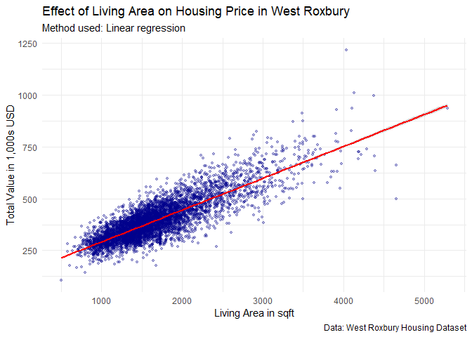

# Data Visualization Project 02

_revised version of mini-project 02 goes here_


``` r
getwd()
```

```
## [1] "C:/Users/Tobias/Documents/Courses FloridaPoly/Semester 3/Data Visualisation and Reproducible Research/Projects/dataviz_final_project(1)/dataviz_final_project-main/project-02"
```


``` r
#Downloads were made manually and then put into the data folder
# Florida Lakes for Spatial Visualization
lakes <- st_read(here("data", "Florida_Lakes", "Florida_Lakes.shp"))
```

```
## Reading layer `Florida_Lakes' from data source 
##   `C:\Users\Tobias\Documents\Courses FloridaPoly\Semester 3\Data Visualisation and Reproducible Research\Projects\dataviz_final_project(1)\dataviz_final_project-main\data\Florida_Lakes\Florida_Lakes.shp' 
##   using driver `ESRI Shapefile'
## Simple feature collection with 4243 features and 6 fields
## Geometry type: MULTIPOLYGON
## Dimension:     XY
## Bounding box:  xmin: -87.42774 ymin: 25.02625 xmax: -80.03097 ymax: 31.00254
## Geodetic CRS:  WGS 84
```


``` r
# FIFA 18 player stats for interactive Visualization
fifa <- read_csv(here("data", "fifa18.csv"))
```

```
## Rows: 17076 Columns: 40
## ── Column specification ────────────────────────────────────────────────────────
## Delimiter: ","
## chr  (3): name, nationality, club
## dbl (37): age, overall, potential, acceleration, aggression, agility, balanc...
## 
## ℹ Use `spec()` to retrieve the full column specification for this data.
## ℹ Specify the column types or set `show_col_types = FALSE` to quiet this message.
```

``` r
head(fifa)
```

```
## # A tibble: 6 × 40
##   name         nationality club    age overall potential acceleration aggression
##   <chr>        <chr>       <chr> <dbl>   <dbl>     <dbl>        <dbl>      <dbl>
## 1 Cristiano R… Portugal    Real…    32      94        94           89         63
## 2 L. Messi     Argentina   FC B…    30      93        93           92         48
## 3 Neymar       Brazil      Pari…    25      92        94           94         56
## 4 L. Suárez    Uruguay     FC B…    30      92        92           88         78
## 5 M. Neuer     Germany     FC B…    31      92        92           58         29
## 6 R. Lewandow… Poland      FC B…    28      91        91           79         80
## # ℹ 32 more variables: agility <dbl>, balance <dbl>, ball_control <dbl>,
## #   composure <dbl>, crossing <dbl>, curve <dbl>, dribbling <dbl>,
## #   finishing <dbl>, free_kick_accuracy <dbl>, gk_diving <dbl>,
## #   gk_handling <dbl>, gk_kicking <dbl>, gk_positioning <dbl>,
## #   gk_reflexes <dbl>, heading_accuracy <dbl>, interceptions <dbl>,
## #   jumping <dbl>, long_passing <dbl>, long_shots <dbl>, marking <dbl>,
## #   penalties <dbl>, positioning <dbl>, reactions <dbl>, short_passing <dbl>, …
```

``` r
#Houses in West Roxbury
houses <- read_csv(here("data", "WestRoxbury.csv"))
```

```
## Rows: 5802 Columns: 14
## ── Column specification ────────────────────────────────────────────────────────
## Delimiter: ","
## chr  (1): REMODEL
## dbl (13): TOTAL VALUE, TAX, LOT SQFT, YR BUILT, GROSS AREA, LIVING AREA, FLO...
## 
## ℹ Use `spec()` to retrieve the full column specification for this data.
## ℹ Specify the column types or set `show_col_types = FALSE` to quiet this message.
```
# My Approach

## The Ideas

### 1. Interactive Visualization – Player Stats in FIFA 18
Since I’m a big football enthusiast and have played the FIFA video game series for many years, I know that the “pace” stat is crucial for a player to be considered usable or even “meta”, which means top-tier, in the game. For better understanding, in the online mode of the FIFA Games (called Fifa Ultimate Team), each user builds their own squad with players they can link together based on chemistry (League, Club, Nationality). Each player has different stats. With this visualization, I want to explore how speed compares among the highest-rated players and gain interactive insights into how many of them are potentially impactful in gameplay.

### 2. Spatial Visualization – Lakes in Florida
My first idea is to visualize the largest lakes in Florida, focusing on Polk County. I wanted to see which lakes have the largest surface area, especially since I recently went on a trail run along Lake Hancock. That made me curious how it compares to others in the county and sparked my interest in exploring the lake topography.

### 3. Model-Based Visualization – West Roxbury Housing Prices
For the final visualization, I wanted to explore how certain home characteristics might influence housing prices. Something that would be interesting to investigate is how the size of a home, affects its  value.

# Data Visualizations

## 1. FIFA 18 Ratings - Interactive Plot
### Data Preparation


``` r
#Prepare the dataset for 30 best rated players with relevant pace attributes annd player information
fifa_top30 <- fifa %>%
  arrange(desc(overall)) %>%
  slice(1:30) %>%
  select(name, nationality, club, age, overall, sprint_speed, acceleration, stamina)
fifa_top30
```

```
## # A tibble: 30 × 8
##    name        nationality club    age overall sprint_speed acceleration stamina
##    <chr>       <chr>       <chr> <dbl>   <dbl>        <dbl>        <dbl>   <dbl>
##  1 Cristiano … Portugal    Real…    32      94           91           89      92
##  2 L. Messi    Argentina   FC B…    30      93           87           92      73
##  3 Neymar      Brazil      Pari…    25      92           90           94      78
##  4 L. Suárez   Uruguay     FC B…    30      92           77           88      89
##  5 M. Neuer    Germany     FC B…    31      92           61           58      44
##  6 R. Lewando… Poland      FC B…    28      91           83           79      79
##  7 De Gea      Spain       Manc…    26      90           58           57      40
##  8 E. Hazard   Belgium     Chel…    26      90           87           93      79
##  9 T. Kroos    Germany     Real…    27      90           52           60      77
## 10 G. Higuaín  Argentina   Juve…    29      90           80           78      72
## # ℹ 20 more rows
```
### Visualization

``` r
p <- ggplot(fifa_top30, aes(x = sprint_speed, y = overall,
                            color = nationality,
                            text = paste("Name:", name,
                              "<br>Club:", club,
                              "<br>Nation:", nationality,
                              "<br>Sprint Speed:", sprint_speed,
                              "<br>Acceleration:", acceleration,
                              "<br>Stamina:", stamina,
                              "<br>Overall:", overall))) +
  geom_point(size = 2, alpha = 0.75) +
  labs(title = "Top 30 FIFA 18 Players: Sprint Speed vs Overall Rating",
    subtitle = "Colored by nationality | Hover for detailed attributes",
    caption="Data: EA Sports",
    x = "Sprint Speed",
    y = "Overall Rating",
    color = "Nationality") +
  theme_minimal()

ggplotly(p, tooltip = "text")
```

```{=html}
<div class="plotly html-widget html-fill-item" id="htmlwidget-c38579fa28485d72a5a4" style="width:672px;height:480px;"></div>
<script type="application/json" data-for="htmlwidget-c38579fa28485d72a5a4">{"x":{"data":[{"x":[87,80,84,84],"y":[93,90,89,88],"text":["Name: L. Messi <br>Club: FC Barcelona <br>Nation: Argentina <br>Sprint Speed: 87 <br>Acceleration: 92 <br>Stamina: 73 <br>Overall: 93","Name: G. Higuaín <br>Club: Juventus <br>Nation: Argentina <br>Sprint Speed: 80 <br>Acceleration: 78 <br>Stamina: 72 <br>Overall: 90","Name: S. Agüero <br>Club: Manchester City <br>Nation: Argentina <br>Sprint Speed: 84 <br>Acceleration: 90 <br>Stamina: 74 <br>Overall: 89","Name: P. Dybala <br>Club: Juventus <br>Nation: Argentina <br>Sprint Speed: 84 <br>Acceleration: 88 <br>Stamina: 83 <br>Overall: 88"],"type":"scatter","mode":"markers","marker":{"autocolorscale":false,"color":"rgba(248,118,109,1)","opacity":0.75,"size":7.559055118110237,"symbol":"circle","line":{"width":1.8897637795275593,"color":"rgba(248,118,109,1)"}},"hoveron":"points","name":"Argentina","legendgroup":"Argentina","showlegend":true,"xaxis":"x","yaxis":"y","hoverinfo":"text","frame":null},{"x":[87,75,52],"y":[90,89,89],"text":["Name: E. Hazard <br>Club: Chelsea <br>Nation: Belgium <br>Sprint Speed: 87 <br>Acceleration: 93 <br>Stamina: 79 <br>Overall: 90","Name: K. De Bruyne <br>Club: Manchester City <br>Nation: Belgium <br>Sprint Speed: 75 <br>Acceleration: 76 <br>Stamina: 87 <br>Overall: 89","Name: T. Courtois <br>Club: Chelsea <br>Nation: Belgium <br>Sprint Speed: 52 <br>Acceleration: 46 <br>Stamina: 38 <br>Overall: 89"],"type":"scatter","mode":"markers","marker":{"autocolorscale":false,"color":"rgba(229,135,0,1)","opacity":0.75,"size":7.559055118110237,"symbol":"circle","line":{"width":1.8897637795275593,"color":"rgba(229,135,0,1)"}},"hoveron":"points","name":"Belgium","legendgroup":"Belgium","showlegend":true,"xaxis":"x","yaxis":"y","hoverinfo":"text","frame":null},{"x":[90],"y":[92],"text":"Name: Neymar <br>Club: Paris Saint-Germain <br>Nation: Brazil <br>Sprint Speed: 90 <br>Acceleration: 94 <br>Stamina: 78 <br>Overall: 92","type":"scatter","mode":"markers","marker":{"autocolorscale":false,"color":"rgba(201,152,0,1)","opacity":0.75,"size":7.559055118110237,"symbol":"circle","line":{"width":1.8897637795275593,"color":"rgba(201,152,0,1)"}},"hoveron":"points","name":"Brazil","legendgroup":"Brazil","showlegend":true,"xaxis":"x","yaxis":"y","hoverinfo":"text","frame":null},{"x":[84],"y":[89],"text":"Name: A. Sánchez <br>Club: Arsenal <br>Nation: Chile <br>Sprint Speed: 84 <br>Acceleration: 88 <br>Stamina: 85 <br>Overall: 89","type":"scatter","mode":"markers","marker":{"autocolorscale":false,"color":"rgba(163,165,0,1)","opacity":0.75,"size":7.559055118110237,"symbol":"circle","line":{"width":1.8897637795275593,"color":"rgba(163,165,0,1)"}},"hoveron":"points","name":"Chile","legendgroup":"Chile","showlegend":true,"xaxis":"x","yaxis":"y","hoverinfo":"text","frame":null},{"x":[71],"y":[89],"text":"Name: L. Modrić <br>Club: Real Madrid CF <br>Nation: Croatia <br>Sprint Speed: 71 <br>Acceleration: 75 <br>Stamina: 82 <br>Overall: 89","type":"scatter","mode":"markers","marker":{"autocolorscale":false,"color":"rgba(107,177,0,1)","opacity":0.75,"size":7.559055118110237,"symbol":"circle","line":{"width":1.8897637795275593,"color":"rgba(107,177,0,1)"}},"hoveron":"points","name":"Croatia","legendgroup":"Croatia","showlegend":true,"xaxis":"x","yaxis":"y","hoverinfo":"text","frame":null},{"x":[86,63],"y":[88,88],"text":["Name: A. Griezmann <br>Club: Atlético Madrid <br>Nation: France <br>Sprint Speed: 86 <br>Acceleration: 87 <br>Stamina: 76 <br>Overall: 88","Name: H. Lloris <br>Club: Tottenham Hotspur <br>Nation: France <br>Sprint Speed: 63 <br>Acceleration: 65 <br>Stamina: 41 <br>Overall: 88"],"type":"scatter","mode":"markers","marker":{"autocolorscale":false,"color":"rgba(0,186,56,1)","opacity":0.75,"size":7.559055118110237,"symbol":"circle","line":{"width":1.8897637795275593,"color":"rgba(0,186,56,1)"}},"hoveron":"points","name":"France","legendgroup":"France","showlegend":true,"xaxis":"x","yaxis":"y","hoverinfo":"text","frame":null},{"x":[96],"y":[88],"text":"Name: P. Aubameyang <br>Club: Borussia Dortmund <br>Nation: Gabon <br>Sprint Speed: 96 <br>Acceleration: 95 <br>Stamina: 79 <br>Overall: 88","type":"scatter","mode":"markers","marker":{"autocolorscale":false,"color":"rgba(0,191,125,1)","opacity":0.75,"size":7.559055118110237,"symbol":"circle","line":{"width":1.8897637795275593,"color":"rgba(0,191,125,1)"}},"hoveron":"points","name":"Gabon","legendgroup":"Gabon","showlegend":true,"xaxis":"x","yaxis":"y","hoverinfo":"text","frame":null},{"x":[61,52,78,65,68],"y":[92,90,88,88,88],"text":["Name: M. Neuer <br>Club: FC Bayern Munich <br>Nation: Germany <br>Sprint Speed: 61 <br>Acceleration: 58 <br>Stamina: 44 <br>Overall: 92","Name: T. Kroos <br>Club: Real Madrid CF <br>Nation: Germany <br>Sprint Speed: 52 <br>Acceleration: 60 <br>Stamina: 77 <br>Overall: 90","Name: J. Boateng <br>Club: FC Bayern Munich <br>Nation: Germany <br>Sprint Speed: 78 <br>Acceleration: 72 <br>Stamina: 74 <br>Overall: 88","Name: M. Hummels <br>Club: FC Bayern Munich <br>Nation: Germany <br>Sprint Speed: 65 <br>Acceleration: 62 <br>Stamina: 66 <br>Overall: 88","Name: M. Özil <br>Club: Arsenal <br>Nation: Germany <br>Sprint Speed: 68 <br>Acceleration: 75 <br>Stamina: 69 <br>Overall: 88"],"type":"scatter","mode":"markers","marker":{"autocolorscale":false,"color":"rgba(0,192,175,1)","opacity":0.75,"size":7.559055118110237,"symbol":"circle","line":{"width":1.8897637795275593,"color":"rgba(0,192,175,1)"}},"hoveron":"points","name":"Germany","legendgroup":"Germany","showlegend":true,"xaxis":"x","yaxis":"y","hoverinfo":"text","frame":null},{"x":[78,43,72],"y":[89,89,88],"text":["Name: G. Chiellini <br>Club: Juventus <br>Nation: Italy <br>Sprint Speed: 78 <br>Acceleration: 68 <br>Stamina: 68 <br>Overall: 89","Name: G. Buffon <br>Club: Juventus <br>Nation: Italy <br>Sprint Speed: 43 <br>Acceleration: 49 <br>Stamina: 39 <br>Overall: 89","Name: L. Bonucci <br>Club: Milan <br>Nation: Italy <br>Sprint Speed: 72 <br>Acceleration: 62 <br>Stamina: 73 <br>Overall: 88"],"type":"scatter","mode":"markers","marker":{"autocolorscale":false,"color":"rgba(0,188,216,1)","opacity":0.75,"size":7.559055118110237,"symbol":"circle","line":{"width":1.8897637795275593,"color":"rgba(0,188,216,1)"}},"hoveron":"points","name":"Italy","legendgroup":"Italy","showlegend":true,"xaxis":"x","yaxis":"y","hoverinfo":"text","frame":null},{"x":[83],"y":[91],"text":"Name: R. Lewandowski <br>Club: FC Bayern Munich <br>Nation: Poland <br>Sprint Speed: 83 <br>Acceleration: 79 <br>Stamina: 79 <br>Overall: 91","type":"scatter","mode":"markers","marker":{"autocolorscale":false,"color":"rgba(0,176,246,1)","opacity":0.75,"size":7.559055118110237,"symbol":"circle","line":{"width":1.8897637795275593,"color":"rgba(0,176,246,1)"}},"hoveron":"points","name":"Poland","legendgroup":"Poland","showlegend":true,"xaxis":"x","yaxis":"y","hoverinfo":"text","frame":null},{"x":[91],"y":[94],"text":"Name: Cristiano Ronaldo <br>Club: Real Madrid CF <br>Nation: Portugal <br>Sprint Speed: 91 <br>Acceleration: 89 <br>Stamina: 92 <br>Overall: 94","type":"scatter","mode":"markers","marker":{"autocolorscale":false,"color":"rgba(97,156,255,1)","opacity":0.75,"size":7.559055118110237,"symbol":"circle","line":{"width":1.8897637795275593,"color":"rgba(97,156,255,1)"}},"hoveron":"points","name":"Portugal","legendgroup":"Portugal","showlegend":true,"xaxis":"x","yaxis":"y","hoverinfo":"text","frame":null},{"x":[60],"y":[88],"text":"Name: J. Oblak <br>Club: Atlético Madrid <br>Nation: Slovenia <br>Sprint Speed: 60 <br>Acceleration: 43 <br>Stamina: 41 <br>Overall: 88","type":"scatter","mode":"markers","marker":{"autocolorscale":false,"color":"rgba(185,131,255,1)","opacity":0.75,"size":7.559055118110237,"symbol":"circle","line":{"width":1.8897637795275593,"color":"rgba(185,131,255,1)"}},"hoveron":"points","name":"Slovenia","legendgroup":"Slovenia","showlegend":true,"xaxis":"x","yaxis":"y","hoverinfo":"text","frame":null},{"x":[58,77,68],"y":[90,90,88],"text":["Name: De Gea <br>Club: Manchester United <br>Nation: Spain <br>Sprint Speed: 58 <br>Acceleration: 57 <br>Stamina: 40 <br>Overall: 90","Name: Sergio Ramos <br>Club: Real Madrid CF <br>Nation: Spain <br>Sprint Speed: 77 <br>Acceleration: 75 <br>Stamina: 84 <br>Overall: 90","Name: Thiago <br>Club: FC Bayern Munich <br>Nation: Spain <br>Sprint Speed: 68 <br>Acceleration: 77 <br>Stamina: 75 <br>Overall: 88"],"type":"scatter","mode":"markers","marker":{"autocolorscale":false,"color":"rgba(231,107,243,1)","opacity":0.75,"size":7.559055118110237,"symbol":"circle","line":{"width":1.8897637795275593,"color":"rgba(231,107,243,1)"}},"hoveron":"points","name":"Spain","legendgroup":"Spain","showlegend":true,"xaxis":"x","yaxis":"y","hoverinfo":"text","frame":null},{"x":[77,67],"y":[92,88],"text":["Name: L. Suárez <br>Club: FC Barcelona <br>Nation: Uruguay <br>Sprint Speed: 77 <br>Acceleration: 88 <br>Stamina: 89 <br>Overall: 92","Name: D. Godín <br>Club: Atlético Madrid <br>Nation: Uruguay <br>Sprint Speed: 67 <br>Acceleration: 62 <br>Stamina: 67 <br>Overall: 88"],"type":"scatter","mode":"markers","marker":{"autocolorscale":false,"color":"rgba(253,97,209,1)","opacity":0.75,"size":7.559055118110237,"symbol":"circle","line":{"width":1.8897637795275593,"color":"rgba(253,97,209,1)"}},"hoveron":"points","name":"Uruguay","legendgroup":"Uruguay","showlegend":true,"xaxis":"x","yaxis":"y","hoverinfo":"text","frame":null},{"x":[95],"y":[89],"text":"Name: G. Bale <br>Club: Real Madrid CF <br>Nation: Wales <br>Sprint Speed: 95 <br>Acceleration: 93 <br>Stamina: 76 <br>Overall: 89","type":"scatter","mode":"markers","marker":{"autocolorscale":false,"color":"rgba(255,103,164,1)","opacity":0.75,"size":7.559055118110237,"symbol":"circle","line":{"width":1.8897637795275593,"color":"rgba(255,103,164,1)"}},"hoveron":"points","name":"Wales","legendgroup":"Wales","showlegend":true,"xaxis":"x","yaxis":"y","hoverinfo":"text","frame":null}],"layout":{"margin":{"t":43.762557077625573,"r":7.3059360730593621,"b":40.182648401826491,"l":37.260273972602747},"font":{"color":"rgba(0,0,0,1)","family":"","size":14.611872146118724},"title":{"text":"Top 30 FIFA 18 Players: Sprint Speed vs Overall Rating","font":{"color":"rgba(0,0,0,1)","family":"","size":17.534246575342465},"x":0,"xref":"paper"},"xaxis":{"domain":[0,1],"automargin":true,"type":"linear","autorange":false,"range":[40.350000000000001,98.650000000000006],"tickmode":"array","ticktext":["50","60","70","80","90"],"tickvals":[50,60,70,80,90],"categoryorder":"array","categoryarray":["50","60","70","80","90"],"nticks":null,"ticks":"","tickcolor":null,"ticklen":3.6529680365296811,"tickwidth":0,"showticklabels":true,"tickfont":{"color":"rgba(77,77,77,1)","family":"","size":11.68949771689498},"tickangle":-0,"showline":false,"linecolor":null,"linewidth":0,"showgrid":true,"gridcolor":"rgba(235,235,235,1)","gridwidth":0.66417600664176002,"zeroline":false,"anchor":"y","title":{"text":"Sprint Speed","font":{"color":"rgba(0,0,0,1)","family":"","size":14.611872146118724}},"hoverformat":".2f"},"yaxis":{"domain":[0,1],"automargin":true,"type":"linear","autorange":false,"range":[87.700000000000003,94.299999999999997],"tickmode":"array","ticktext":["88","90","92","94"],"tickvals":[88,90,92,94],"categoryorder":"array","categoryarray":["88","90","92","94"],"nticks":null,"ticks":"","tickcolor":null,"ticklen":3.6529680365296811,"tickwidth":0,"showticklabels":true,"tickfont":{"color":"rgba(77,77,77,1)","family":"","size":11.68949771689498},"tickangle":-0,"showline":false,"linecolor":null,"linewidth":0,"showgrid":true,"gridcolor":"rgba(235,235,235,1)","gridwidth":0.66417600664176002,"zeroline":false,"anchor":"x","title":{"text":"Overall Rating","font":{"color":"rgba(0,0,0,1)","family":"","size":14.611872146118724}},"hoverformat":".2f"},"shapes":[{"type":"rect","fillcolor":null,"line":{"color":null,"width":0,"linetype":[]},"yref":"paper","xref":"paper","x0":0,"x1":1,"y0":0,"y1":1}],"showlegend":true,"legend":{"bgcolor":null,"bordercolor":null,"borderwidth":0,"font":{"color":"rgba(0,0,0,1)","family":"","size":11.68949771689498},"title":{"text":"Nationality","font":{"color":"rgba(0,0,0,1)","family":"","size":14.611872146118724}}},"hovermode":"closest","barmode":"relative"},"config":{"doubleClick":"reset","modeBarButtonsToAdd":["hoverclosest","hovercompare"],"showSendToCloud":false},"source":"A","attrs":{"406861546b56":{"x":{},"y":{},"colour":{},"text":{},"type":"scatter"}},"cur_data":"406861546b56","visdat":{"406861546b56":["function (y) ","x"]},"highlight":{"on":"plotly_click","persistent":false,"dynamic":false,"selectize":false,"opacityDim":0.20000000000000001,"selected":{"opacity":1},"debounce":0},"shinyEvents":["plotly_hover","plotly_click","plotly_selected","plotly_relayout","plotly_brushed","plotly_brushing","plotly_clickannotation","plotly_doubleclick","plotly_deselect","plotly_afterplot","plotly_sunburstclick"],"base_url":"https://plot.ly"},"evals":[],"jsHooks":[]}</script>
```

## 2. Florida Lakes - Spatial Visualization

### Data Preparation

``` r
# Prepare: issues convert it into metric system, instead of coordinate reference system with degrees 
lakes_m <- st_transform(lakes, crs = 5070)

# bring the areas to m²
lakes_m$area_m2 <- st_area(lakes_m)

#filter Polk County select top 10 largest lakes
lakes_polk_top10 <- lakes_m %>%
  filter(COUNTY == "POLK") %>%
  slice_max(SHAPEAREA, n = 10)

lakes_polk_top10
```

```
## Simple feature collection with 10 features and 7 fields
## Geometry type: MULTIPOLYGON
## Dimension:     XY
## Bounding box:  xmin: 1380359 ymin: 621996.5 xmax: 1444512 ymax: 667924.2
## Projected CRS: NAD83 / Conus Albers
##    PERIMETER             NAME COUNTY OBJECTID SHAPEAREA SHAPELEN        area_m2
## 1   21529.93 Lake Weohyakapka   POLK     2700  30549713 21529.93 30549713 [m^2]
## 2   19950.41     Lake Hancock   POLK     2703  18549186 19950.40 18549186 [m^2]
## 3   18557.39     Lake Rosalie   POLK     2701  18358611 18557.39 18358611 [m^2]
## 4   34664.94     Crooked Lake   POLK     2690  16885793 34664.94 16885793 [m^2]
## 5   31582.90      Lake Pierce   POLK     1937  15604508 31582.90 15604508 [m^2]
## 6   20955.50    Lake Arbuckle   POLK     3907  15412988 20955.50 15412988 [m^2]
## 7   16652.12       Reedy Lake   POLK       76  14191962 16652.12 14191962 [m^2]
## 8   21007.95      Lake Marion   POLK     1936  12226186 21007.95 12226186 [m^2]
## 9   16855.88    Lake Hamilton   POLK       67   8668138 16855.88  8668138 [m^2]
## 10  21815.34      Lake Parker   POLK     1608   8533253 21815.34  8533253 [m^2]
##                          geometry
## 1  MULTIPOLYGON (((1437081 641...
## 2  MULTIPOLYGON (((1393835 646...
## 3  MULTIPOLYGON (((1436798 653...
## 4  MULTIPOLYGON (((1422458 631...
## 5  MULTIPOLYGON (((1426426 652...
## 6  MULTIPOLYGON (((1439228 627...
## 7  MULTIPOLYGON (((1427767 629...
## 8  MULTIPOLYGON (((1420520 667...
## 9  MULTIPOLYGON (((1409616 662...
## 10 MULTIPOLYGON (((1382467 658...
```

### Visualization

``` r
ggplot(lakes_polk_top10) +
  geom_sf(aes(fill = as.numeric(area_m2)), color = "black", alpha =0.9, size=0.2)+
  scale_fill_viridis_c(option = "inferno",
    name = "Lake Area in m²",
    labels = scales::label_number(scale = 1e-6, suffix = "M"),
    breaks = scales::breaks_pretty(n = 5))+
  labs(title = "Top 10 Largest Lakes in Polk County, Florida",
    subtitle = "Based on surface area",
    caption = "Data: Florida Department of Environmental Protection") +
  theme_minimal()+
  theme(axis.title = element_blank(),
    plot.title = element_text(face = "bold", size = 14),
    plot.subtitle = element_text(size = 10),
    legend.position = "bottom")+
  geom_sf_label(aes(label = NAME), size = 2.5, color = "black") +
  coord_sf(crs = "+proj=aea +lat_1=24 +lat_2=31 +lat_0=23 +lon_0=-84")
```

<!-- -->

## 3. West Roxbury Housing Prices - Model-Based Visualization

### Data Preparation

``` r
colnames(houses)
```

```
##  [1] "TOTAL VALUE" "TAX"         "LOT SQFT"    "YR BUILT"    "GROSS AREA" 
##  [6] "LIVING AREA" "FLOORS"      "ROOMS"       "BEDROOMS"    "FULL BATH"  
## [11] "HALF BATH"   "KITCHEN"     "FIREPLACE"   "REMODEL"
```

``` r
head(houses)
```

```
## # A tibble: 6 × 14
##   `TOTAL VALUE`   TAX `LOT SQFT` `YR BUILT` `GROSS AREA` `LIVING AREA` FLOORS
##           <dbl> <dbl>      <dbl>      <dbl>        <dbl>         <dbl>  <dbl>
## 1          344.  4330       9965       1880         2436          1352      2
## 2          413.  5190       6590       1945         3108          1976      2
## 3          330.  4152       7500       1890         2294          1371      2
## 4          499.  6272      13773       1957         5032          2608      1
## 5          332.  4170       5000       1910         2370          1438      2
## 6          337.  4244       5142       1950         2124          1060      1
## # ℹ 7 more variables: ROOMS <dbl>, BEDROOMS <dbl>, `FULL BATH` <dbl>,
## #   `HALF BATH` <dbl>, KITCHEN <dbl>, FIREPLACE <dbl>, REMODEL <chr>
```

``` r
#no real dataset preparation needed
```

### Visualization

``` r
ggplot(houses, aes(x = `LIVING AREA`, y = `TOTAL VALUE`))+
  geom_point(alpha = 0.3, color = "darkblue", size=1)+
  geom_smooth(method = "lm", se = TRUE, color = "red")+
  labs(title = "Effect of Living Area on Housing Price in West Roxbury",
    subtitle = "Method used: Linear regression",
    caption = "Data: West Roxbury Housing Dataset",
    x = "Living Area in sqft",
    y = "Total Value in 1,000s USD")+
  theme_minimal()
```

```
## `geom_smooth()` using formula = 'y ~ x'
```

<!-- -->

# Discussion report

The following section addresses the questions for the report. With a subheader for each visualisation.

## Introduction
This mini-project 2 explores three different real-world datasets through different types of visualizations: interactive, spatial, and model-based. The goal is to gain insights into diverse categories:videogames, geography, and real estate. Each visualization was chosen based on personal interest and its potential to reveal meaningful insights.

***Side Note Regarding FIFA 18:*** *For better understanding, in the online mode of the FIFA Games (called Fifa Ultimate Team),  users build their own squads by linking players together based on chemistry (League, Club, Nationality).Pace, consisting of Sprint speed and acceleration, is one of the most valued attributes, as it significantly affects in-game performance and usability.*

## What were the original charts you planned to create for this assignments? What steps were necessary for cleaning and preparing the data?
**1.Interactive Visualization:** A scatter plot of FIFA 18 player stats, focusing on overall rating and sprint speed. The goal was to explore how  pacey the top players of FIFA 18 are. To give users insight on how well players might fit their online squad taht rey are building. The chart includes interactivity, allowing  to hover over points to view general information about each player, such as name, nationality, club (which is relevant for the chemistry), as well as the pace related stats acceleration, and stamina. Points are color coded by nationality.
The FIFA 18 player statistics, the dataset contained a large number of players and variables. To focus the analysis, the top 30 players were selected based on their overall rating. Attributes related to pace, specifically sprint speed, acceleration, and stamina, were selected and set as important attributes. The data was formatted to allow proper interactivity, including tooltips displaying nationality and player specific information.

**2. Spatial Visualization:**A map of the 10 largest lakes by area in Polk County, Florida. The map was designed to explore their geographic distribution and relative sizes. Each lake is color-filled according to its surface area, and labeled with its name to improve orientation and recognition. The goal was to understand how these major lakes are distributed across the county and which ones have the largest extent.
For the spatial visualization, the original lake data used a geographic coordinate system, which measures in degrees and is not properly for easy to understand areas To fix this, it has been transformed into a projected system and calculated the lake areas in square meters using st_area(). The dataset then has been filtered for lakes in Polk County and selected the 10 largest by area for the final map.
For the model-based visualization using the West Roxbury housing dataset, only minimal data preparation was necessary. Especially, making sure of right column names. The dataset included living area (in square feet) and total home value (in U.S. dollars), making it suitable for regression analysis. Column names containing spaces were accessed using backticks to ensure functionality. The data was then used to explore the relationship between home size and property value through a scatter plot with a fitted regression line.

**3. Model-Based Visualization**:  A regression plot showing the relationship between living area and housing prices in West Roxbury, using a linear trend line. The goal was to understand how home size influences value and whether a clear linear association can be observed.

## What story could you tell with your plots? What difficulties did you encounter while creating the visualizations? What additional approaches do you think can be use to explore the data you selected?
**1. Spatial Visualization:**
The map reveals that the largest lakes in Polk County are scattered across different areas, with a noticeable concentration in the eastern part of the county. The largest among them is Lake Weohyakapka. Including the lake names added helpful geographic context, but also posed visual challenges—some labels overlapped or obscured the lakes beneath them. This required several iterations with label size, positioning, and map theme to find a readable balance. Further another challenge was in the data preparation,  the original coordinate system used degrees as units, which are not suitable for displaying surface areas (it would be degrees²). To ensure accurate area values in square meters, I had to transform the data to a coordinate reference system, which was complicated to find out.
While the current map provides a clear overview, a future improvement could be to add a location map of Florida to better situate Polk County within the state and put landmarks or cities within to further increase orientation.

**2.Interactive Visualization:**
This plot helps identify whether top-rated players in FIFA 18 also possess strong sprint speed, a stat that is crucial for in-game performance and often a deciding factor when users select players for a team. The interactive tooltips allow further exploration of individual attributes like pace related acceleration and stamina or general team building related information such as nation, name and club. The goal was to see players who are both highly rated overall and exceptionally fast, so they can be used in the users team. The visualization reveals that some of the highest-rated players, such as Mats Hummels or Toni Kroos, may not be ideal for gameplay due to their lack of pace. Conversely, players like Aubameyang, who has a lower overall rating (88) but exceptional sprint speed (96), are often preferred over slower but higher-rated players like Luis Suárez (92 overall, 77 sprint speed), because they make a greater impact in fast-paced gameplay.
This view offers an engaging way to evaluate which players are actually viable in-game, beyond their overall rating. A valuable future extension could involve comparing attributes like sprint speed with passing for midfielders, defending for defenders, and shooting for attackers depending on a player's position. This would help identify well-rounded players and position-specific viable options, and offer more useful insights into gameplay decisions. 
A key challenge was finding the balance between clarity and detail, too many players could have overwhelmed the viewer, so finding the right amount of player to display with only the relevant information required some careful testing.

**3. Model-Based Visualization:**
This scatter plot with a regression line shows a positive relationship between living area and housing price, confirming the expected trend, larger homes tend to cost more. However, the spread of the data suggests other influencing factors beyond size, such as location, condition, or year built.
One limitation was the lack of clearly labeled units in the dataset. I assumed square feet for living area and USD for price, which seems reasonable based on the value ranges. Further refinement could include multiple regression analysis including more factors, or doing a segmentation of the market by year built.

## How did you apply the principles of data visualizations and design for this assignment?
Throughout the project, I focused on clarity, readability, and visual storytelling. For the spatial visualization of lakes, I used an appropriate color gradient to represent surface area, added lake labels for geographic context and information, and chose a projection that preserved relative area sizes. I adjusted text placement and border color to maintain contrast and neatness.
In the interactive FIFA scatter plot, I applied mapping of attributes, sprint speed and overall rating were plotted on axes to reveal meaningful patterns and relevant insight for users. Color encoding by nationality added another layer of insight, while tooltips provided further context without making the chart overloaded.
For the regression plot of housing prices, I emphasized the relationship between variables using a clean scatterplot with a fitted trend line and minimal theme. Axis labels and units were clearly defined to ensure interpretability.
Across all visualizations, I applied consistency in color usage, labeling, and layout, and ensured each plot communicated its main message effectively without unnecessary complexity.

### Conclusion
This project 2 showed how different types of visualizations, spatial, interactive, and model-based, can each reveal unique insights from diverse datasets. By applying key design principles and incorporating personal interest, the visualizations became engaging and meaningful. The process also highlighted the importance of thoughtful variable selection, clarity, and context in effective data storytelling.


