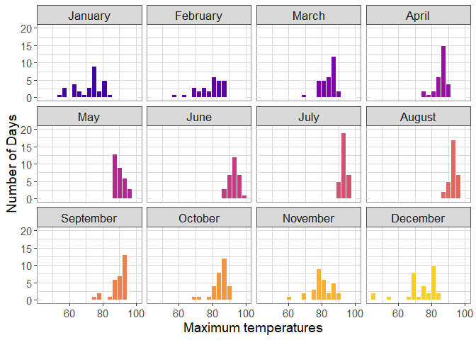
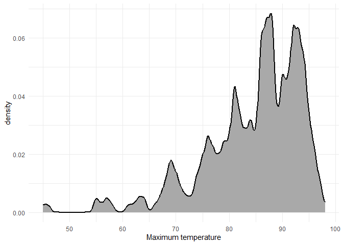
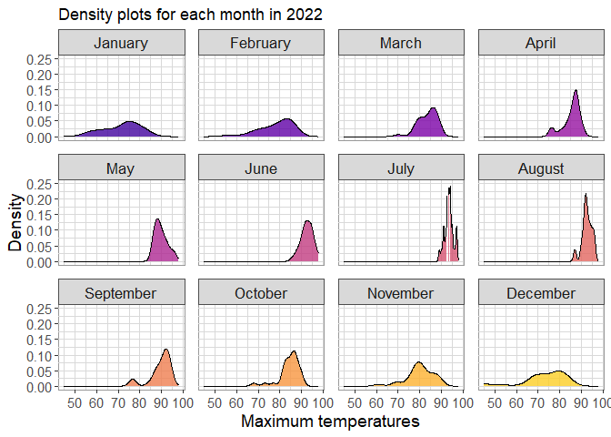
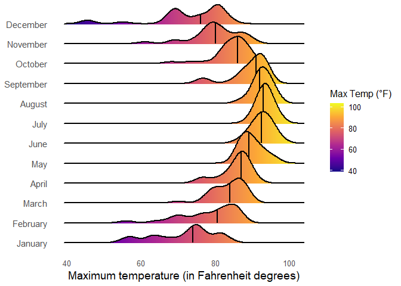
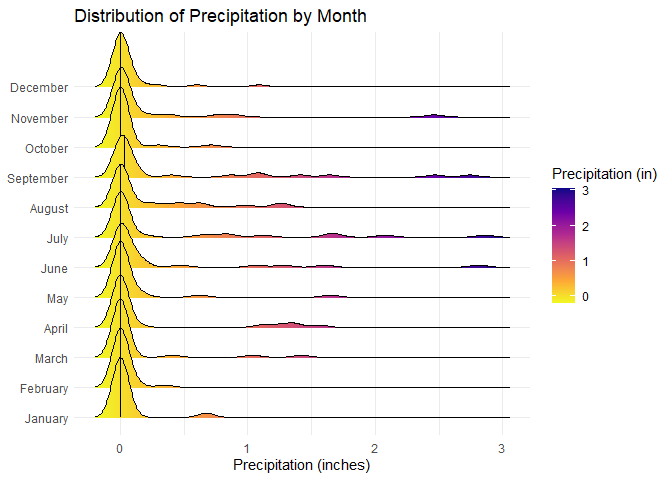
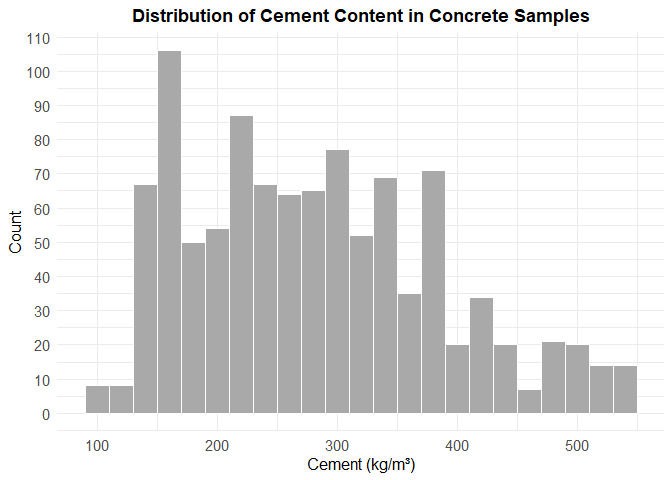
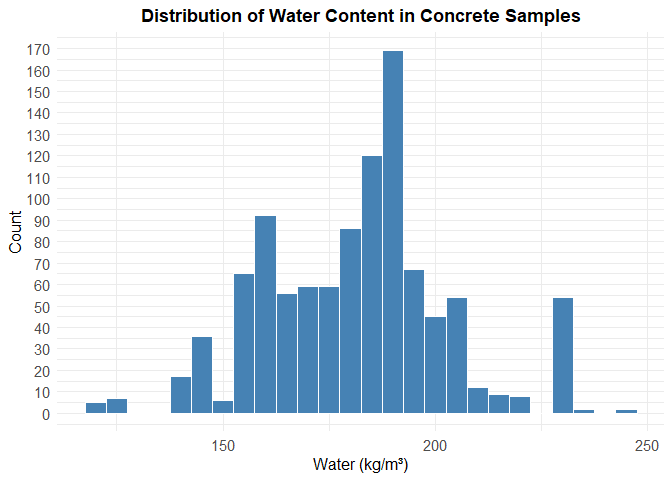
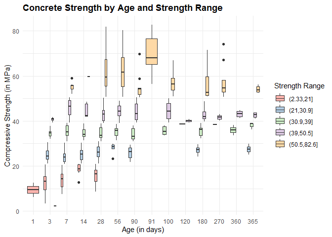
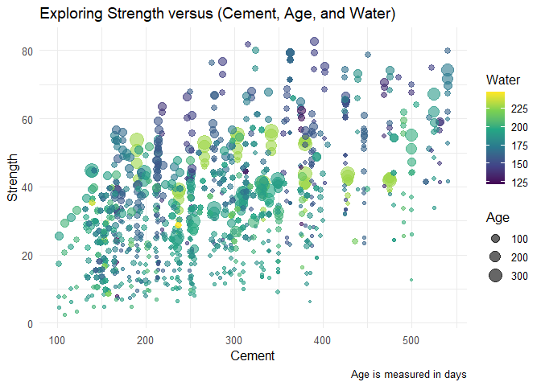

# Data Visualization Project 03


In this exercise you will explore methods to create different types of data visualizations (such as plotting text data, or exploring the distributions of continuous variables).


``` r
library(tidyverse)
library(lubridate)
library(ggplot2)
library(ggridges)
library(viridis)
library(here)
```


## PART 1: Density Plots

Using the dataset obtained from FSU's [Florida Climate Center](https://climatecenter.fsu.edu/climate-data-access-tools/downloadable-data), for a station at Tampa International Airport (TPA) for 2022, attempt to recreate the charts shown below which were generated using data from 2016. You can read the 2022 dataset using the code below: 


``` r
library(tidyverse)
weather_tpa <- read_csv("https://raw.githubusercontent.com/aalhamadani/datasets/master/tpa_weather_2022.csv") %>% 
  mutate(month = month(month, label = TRUE, abbr=FALSE))
# random sample 
sample_n(weather_tpa, 4)
```

```
## # A tibble: 4 × 7
##    year month      day precipitation max_temp min_temp ave_temp
##   <dbl> <ord>    <dbl>         <dbl>    <dbl>    <dbl>    <dbl>
## 1  2022 November    23       0.05          79       65     72  
## 2  2022 Februar     24       0             86       68     77  
## 3  2022 Januar       7       0.00001       81       63     72  
## 4  2022 Mai         28       0             92       77     84.5
```


``` r
glimpse(weather_tpa)
```

```
## Rows: 365
## Columns: 7
## $ year          <dbl> 2022, 2022, 2022, 2022, 2022, 2022, 2022, 2022, 2022, 20…
## $ month         <ord> Januar, Januar, Januar, Januar, Januar, Januar, Januar, …
## $ day           <dbl> 1, 2, 3, 4, 5, 6, 7, 8, 9, 10, 11, 12, 13, 14, 15, 16, 1…
## $ precipitation <dbl> 0.00000, 0.00000, 0.02000, 0.00000, 0.00000, 0.00001, 0.…
## $ max_temp      <dbl> 82, 82, 75, 76, 75, 74, 81, 81, 84, 81, 73, 77, 74, 72, …
## $ min_temp      <dbl> 67, 71, 55, 50, 59, 56, 63, 58, 65, 64, 54, 54, 59, 55, …
## $ ave_temp      <dbl> 74.5, 76.5, 65.0, 63.0, 67.0, 65.0, 72.0, 69.5, 74.5, 72…
```

``` r
#issue the names of the months became german, not sure why
```


``` r
de_to_en <- c("Januar" = "January", "Februar" = "February", "März" = "March",
  "April" = "April", "Mai" = "May", "Juni" = "June",
  "Juli" = "July", "August" = "August", "September" = "September",
  "Oktober" = "October", "November" = "November", "Dezember" = "December")

weather_fix <- weather_tpa %>%
  mutate(month = recode(as.character(month), !!!de_to_en),
    month = factor(month, levels = month.name))
glimpse(weather_fix)
```

```
## Rows: 365
## Columns: 7
## $ year          <dbl> 2022, 2022, 2022, 2022, 2022, 2022, 2022, 2022, 2022, 20…
## $ month         <fct> January, January, January, January, January, January, Ja…
## $ day           <dbl> 1, 2, 3, 4, 5, 6, 7, 8, 9, 10, 11, 12, 13, 14, 15, 16, 1…
## $ precipitation <dbl> 0.00000, 0.00000, 0.02000, 0.00000, 0.00000, 0.00001, 0.…
## $ max_temp      <dbl> 82, 82, 75, 76, 75, 74, 81, 81, 84, 81, 73, 77, 74, 72, …
## $ min_temp      <dbl> 67, 71, 55, 50, 59, 56, 63, 58, 65, 64, 54, 54, 59, 55, …
## $ ave_temp      <dbl> 74.5, 76.5, 65.0, 63.0, 67.0, 65.0, 72.0, 69.5, 74.5, 72…
```

See Slides from Week 4 of Visualizing Relationships and Models (slide 10) for a reminder on how to use this type of dataset with the `lubridate` package for dates and times (example included in the slides uses data from 2016).

Using the 2022 data: 

### Task 1a
(a) Create a plot like the one below:



Hint: the option `binwidth = 3` was used with the `geom_histogram()` function.

### Task 1b
(b) Create a plot like the one below:



Hint: check the `kernel` parameter of the `geom_density()` function, and use `bw = 0.5`.

### Task 1c
(c) Create a plot like the one below:



Hint: default options for `geom_density()` were used. 

### Task 1d
(d) Generate a plot like the chart below:


```
## Picking joint bandwidth of 1.93
```



Hint: use the`{ggridges}` package, and the `geom_density_ridges()` function paying close attention to the `quantile_lines` and `quantiles` parameters. The plot above uses the `plasma` option (color scale) for the _viridis_ palette.

### Task 1e
(e) Create a plot of your choice that uses the attribute for precipitation _(values of -99.9 for temperature or -99.99 for precipitation represent missing data)_.

### 1e Idea
My idea is to create a plot which visualizes for each month how much and how often it rained, valid option for such could be a histogramm or a ridgeline plot like in part d. (Note: I decided to go for the ridgeline plot to better compare distributions)

``` r
weather_rain <- weather_fix %>%
  filter(precipitation != -99.99)
```


``` r
ggplot(weather_rain, aes(x = precipitation, y = month, fill = after_stat(x))) +
  geom_density_ridges_gradient(scale = 2, quantile_lines = TRUE, quantiles = 2, color = "black", alpha = 0.9) +
  scale_fill_viridis_c(option = "plasma", name = "Precipitation (in)", direction=-1) +
  labs( title = "Distribution of Precipitation by Month", x = "Precipitation (inches)", y = NULL) +
  theme_minimal()
```

```
## Picking joint bandwidth of 0.0647
```

<!-- -->

### 1e Result
The plot shows that most days had little to no rain, but there were a few months, especially in summer months with heavier rainfall. The ridgelines make it easy to spot which months had more variation and more intense rain.

## PART 2 Option (B): Data on Concrete Strength 

Concrete is the most important material in **civil engineering**. The concrete compressive strength is a highly nonlinear function of _age_ and _ingredients_. The dataset used here is from the [UCI Machine Learning Repository](https://archive.ics.uci.edu/ml/index.php), and it contains 1030 observations with 9 different attributes 9 (8 quantitative input variables, and 1 quantitative output variable). A data dictionary is included below: 


Variable                      |    Notes                
------------------------------|-------------------------------------------
Cement                        | kg in a $m^3$ mixture             
Blast Furnace Slag            | kg in a $m^3$ mixture  
Fly Ash                       | kg in a $m^3$ mixture             
Water                         | kg in a $m^3$ mixture              
Superplasticizer              | kg in a $m^3$ mixture
Coarse Aggregate              | kg in a $m^3$ mixture
Fine Aggregate                | kg in a $m^3$ mixture      
Age                           | in days                                             
Concrete compressive strength | MPa, megapascals


Below we read the `.csv` file using `readr::read_csv()` (the `readr` package is part of the `tidyverse`)


``` r
getwd()
```

```
## [1] "C:/Users/Tobias/Documents/Courses FloridaPoly/Semester 3/Data Visualisation and Reproducible Research/Projects/dataviz_final_project(1)/dataviz_final_project-main/project-03"
```


``` r
concrete <- read_csv(here("data", "concrete.csv"))
```

```
## Rows: 1030 Columns: 9
## ── Column specification ────────────────────────────────────────────────────────
## Delimiter: ","
## dbl (9): Cement, Blast_Furnace_Slag, Fly_Ash, Water, Superplasticizer, Coars...
## 
## ℹ Use `spec()` to retrieve the full column specification for this data.
## ℹ Specify the column types or set `show_col_types = FALSE` to quiet this message.
```

``` r
glimpse(concrete)
```

```
## Rows: 1,030
## Columns: 9
## $ Cement                        <dbl> 540.0, 540.0, 332.5, 332.5, 198.6, 266.0…
## $ Blast_Furnace_Slag            <dbl> 0.0, 0.0, 142.5, 142.5, 132.4, 114.0, 95…
## $ Fly_Ash                       <dbl> 0, 0, 0, 0, 0, 0, 0, 0, 0, 0, 0, 0, 0, 0…
## $ Water                         <dbl> 162, 162, 228, 228, 192, 228, 228, 228, …
## $ Superplasticizer              <dbl> 2.5, 2.5, 0.0, 0.0, 0.0, 0.0, 0.0, 0.0, …
## $ Coarse_Aggregate              <dbl> 1040.0, 1055.0, 932.0, 932.0, 978.4, 932…
## $ Fine_Aggregate                <dbl> 676.0, 676.0, 594.0, 594.0, 825.5, 670.0…
## $ Age                           <dbl> 28, 28, 270, 365, 360, 90, 365, 28, 28, …
## $ Concrete_compressive_strength <dbl> 79.986111, 61.887366, 40.269535, 41.0527…
```


Let us create a new attribute for visualization purposes, `strength_range`: 


``` r
new_concrete <- concrete %>%
  mutate(strength_range = cut(Concrete_compressive_strength, 
                              breaks = quantile(Concrete_compressive_strength, 
                                                probs = seq(0, 1, 0.2))) )
```


### Task 2.1
1. Explore the distribution of 2 of the continuous variables available in the dataset. Do ranges make sense? Comment on your findings.

``` r
ggplot(new_concrete, aes(x = Cement)) +
  geom_histogram(binwidth = 20, fill = "darkgrey", color = "white") +
  labs(title = "Distribution of Cement Content in Concrete Samples", x = "Cement (kg/m³)", y = "Count") +
  scale_y_continuous(breaks = seq(0, 150, 10)) +
  theme_minimal()+
  theme(plot.title = element_text(hjust = 0.5, face = "bold"),
    axis.title = element_text(size = 12),
    axis.text = element_text(size = 11))
```

<!-- -->


``` r
ggplot(new_concrete, aes(x = Water)) +
  geom_histogram(binwidth = 5, fill = "steelblue", color = "white") +
  labs(title = "Distribution of Water Content in Concrete Samples", x = "Water (kg/m³)", y = "Count") +
  scale_y_continuous(breaks = seq(0, 200, 10)) +
  theme_minimal() +
  theme(plot.title = element_text(hjust = 0.5, face = "bold"),
    axis.title = element_text(size = 12),
    axis.text = element_text(size = 11))
```

<!-- -->

### Comments on Task 2.1
To explore the distribution of two continuous variables from the dataset, I created histograms for Cement and Water content (in kg/$m^3$), I chose these two, because there are the first 2 ingredients I thought off when hearing concrete.

**Cement Content:** The histogram shows a slightly right-skewed distribution, with most values concentrated between 150 and 400 kg/$m^3$. There’s a broad, somewhat uneven spread, with several peaks suggesting that multiple mix types might have been used. Toward the higher end, the number of samples drops off, which makes sense, because very high cement content seems less common.

**Water Content:** The distribution for water is more symmetric and forms a clear bell-like shape centered around 180–200 kg/$m^3$.  This indicates that most mixes used similar amounts of water or with less deviation. The bars are taller and more tightly grouped compared to the cement chart, which suggests less variability and more consistency in water usage across samples.

These distributions also seem reasonable when considering typical concrete mix ratios. A water-to-cement ratio between 0.4 and 0.6 is commonly used in practice for good strength and workability. With cement values mostly between 150–400 kg/$m^3$ and water around 180–200 kg/$m^3$, most samples fall within that expected range, supporting the idea that this is real-world, usable concrete data.

### Task 2.2
2. Use a _temporal_ indicator such as the one available in the variable `Age` (measured in days). Generate a plot similar to the one shown below. Comment on your results.



### Comments on Task 2

The boxplot shows a clear trend of increasing compressive strength with the age of the concrete. In the early days (1 to 14), most samples fall into the lower strength ranges, but as age increases, particularly after 28 days, higher strength categories become more common. The peak in strength appears to be reached around 90 to 100 days. After that point, the strength generally remains stable at a high level, though there is a slight drop or more variation in some later ages. This visual confirms the expected behavior of concrete: it gains strength over time, and after reaching its maximum, it tends to level off rather than continuing to increase indefinitely. There is also some variation within each age group, which could be due to different mix compositions or curing conditions.

### Task 2.3
3. Create a scatterplot similar to the one shown below. Pay special attention to which variables are being mapped to specific aesthetics of the plot. Comment on your results. 



### Comments Task 2.3
This scatterplot visualizes how cement content, age, and water content relate to concrete compressive strength. Overall, we observe a positive relationship between cement and strength, as cement content increases, strength tends to increase as well. Additionally, larger dots, meaning older samples, are generally found higher on the strength axis, confirming that older concrete typically develops more strength over time.

Interestingly, the water content, indicated through the color gradient, shows that higher water levels are more common in lower-strength areas, supporting the idea that too much water can weaken concrete. In contrast, stronger samples often contain moderate water amounts and therefore higher cement.

This plot effectively demonstrates the relation between ingredients and time, highlighting how balanced proportions and longer time contribute to higher compressive strength.


